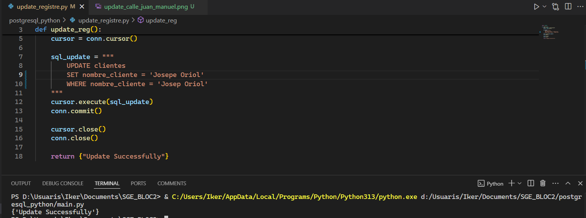
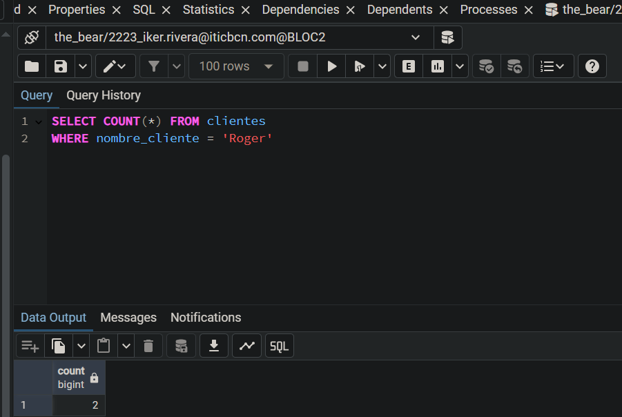

# Connection

La imagen muestra que se ha podido establecer correctamente la conexión a la base de datos y está imprimiendo el estado del conector y la información como el usuario, el nombre de la base de datos, el puerto y si la conexión está abierta (0) o cerrada (1).

# Inserción

La imagen muestra los datos que ha leído del [.CSV](send_data_to_db/Clientes.csv) previamente, y los ha insertado en la base de datos.

# Crear Registro

La imagen muestra que [create_registre.py](postgresql_python/create_registre.py) se ha ejecutado correctamente, y si vamos al PgAdmin podremos ver cómo se han creado correctamente.

# Leer Registro

La imagen muestra la información que hay en la tabla de Clientes.

# Actualizar Registro

Actualizamos el teléfono donde el nombre de cliente sea 'Roger'.

## Otros Updates

En esta imagen estamos actualizando la calle de cualquier cliente que se llame 'Juan Manuel'.

En esta imagen estamos actualizando la fecha de nacimiento de cualquier cliente que se llame 'Mireia'.

En esta imagen estamos actualizando el nombre de cualquier cliente que se llame 'Josep Oriol'.

Y estos son los resultados después de hacer una Query en el PgAdmin.

# Borrar Registro

En esta imagen estamos borrando todos los clientes donde su nombre sean 'Roger'.

Este es el antes:

Como podemos ver hay dos clientes con el nombre de 'Roger'

Y el despues:
